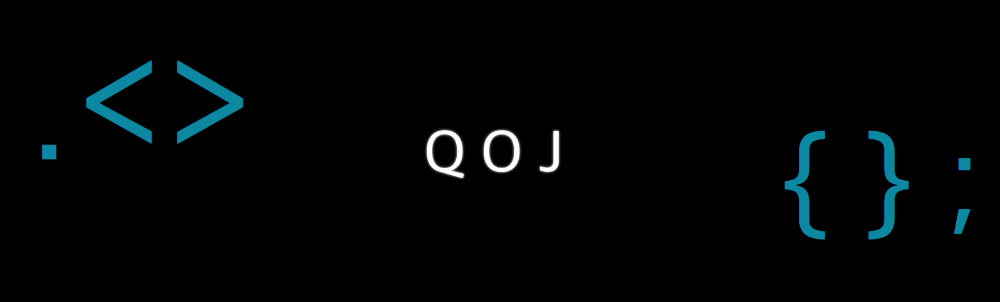
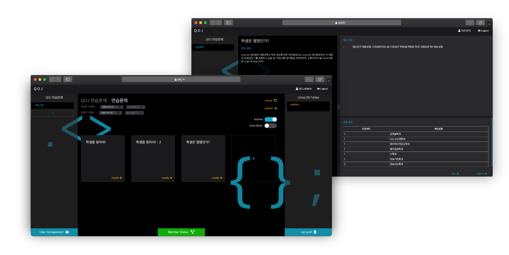

# Q O J

>  QOJ is Oline Judge System Service you can use SQL! 💻

---



---


## Project Stack 🛠

**Client**

- Javascript
- Node JS

**Server**

- Flask
- MySQL 5.7.25


## How to run this app? 🚀
#### Using Only Node JS
1. Donwload packages by npm
   ```shell
   npm install
   ```
2. Run devserver using webpack
   ```shell
   npm run devserver
   ```
3. If you want to build source?
   ```shell
   npm run build
   npm run production
   ```
4. Connect Host, Port = 8000 or not
   (http://localhost:8000)
   
#### Using Flask

1. Download packages by pip3

   ```shell
   pip3 install -r requirements.txt	// Mac or Linux
   
   pip install -r requirements.txt		// Windows
   ```

2. Run application.py using python
   (your computer must be installed MySQL 5.7.25!)

   ```shell
   python3 application.py		// Mac or Linux
   
   python application.py		// Windows
   ```

3. Connect Host, Port = 5000 or not
   (http://localhost:5000)


---

**Member** : @NB(https://github.com/altmshfkgudtjr), @837477(https://github.com/837477)
